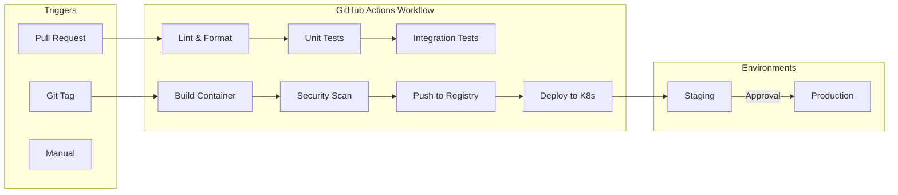

# ML Model Deployment Pipeline — Planning

**Project:** End-to-end MLOps pipeline for deploying ML models to production  
**Created:** 2026-02-05  
**Status:** Planning

---

## Overview

A complete MLOps pipeline that takes ML models from development to production using industry-standard tools. The pipeline handles model versioning, experiment tracking, containerization, and automated deployment to Kubernetes.

---

## Architecture


---

## Component Details

### 1. MLflow Tracking Server


**Responsibilities:**
- Track experiments (parameters, metrics, artifacts)
- Version models in Model Registry
- Store model artifacts in S3-compatible storage
- Serve model metadata via REST API

### 2. Model Serving API


**Endpoints:**
| Endpoint | Method | Description |
|----------|--------|-------------|
| `/health` | GET | Liveness/readiness probe |
| `/predict` | POST | Model inference |
| `/model/info` | GET | Current model version & metadata |
| `/metrics` | GET | Prometheus metrics |

### 3. CI/CD Pipeline



### 4. Kubernetes Deployment


---

## Tech Stack

| Component | Technology | Purpose |
|-----------|------------|---------|
| ML Tracking | MLflow | Experiment tracking, model registry |
| Object Storage | MinIO | S3-compatible artifact storage |
| API Framework | FastAPI | Model serving REST API |
| Containerization | Docker | Package application |
| Orchestration | Kubernetes (k3s) | Container orchestration |
| CI/CD | GitHub Actions | Automated pipeline |
| Monitoring | Prometheus + Grafana | Metrics & dashboards |
| Database | PostgreSQL | MLflow backend store |

---

## Project Structure

```
ml-pipeline/
├── README.md
├── PLANNING.md
├── docker-compose.yml          # Local development stack
├── Makefile                    # Common commands
│
├── src/
│   ├── training/
│   │   ├── train.py           # Model training script
│   │   ├── evaluate.py        # Model evaluation
│   │   └── utils.py           # Training utilities
│   │
│   └── serving/
│       ├── main.py            # FastAPI application
│       ├── model.py           # Model loading & inference
│       ├── schemas.py         # Pydantic schemas
│       └── config.py          # Configuration
│
├── tests/
│   ├── unit/
│   │   ├── test_model.py
│   │   └── test_api.py
│   └── integration/
│       └── test_pipeline.py
│
├── docker/
│   ├── Dockerfile.train       # Training image
│   ├── Dockerfile.serve       # Serving image
│   └── Dockerfile.mlflow      # MLflow server image
│
├── k8s/
│   ├── base/
│   │   ├── deployment.yaml
│   │   ├── service.yaml
│   │   ├── configmap.yaml
│   │   └── hpa.yaml
│   ├── overlays/
│   │   ├── staging/
│   │   └── production/
│   └── kustomization.yaml
│
├── .github/
│   └── workflows/
│       ├── ci.yml             # Test on PR
│       ├── build.yml          # Build & push container
│       └── deploy.yml         # Deploy to k8s
│
├── mlflow/
│   └── docker-compose.yml     # MLflow server setup
│
└── monitoring/
    ├── prometheus.yml
    └── grafana/
        └── dashboards/
```

---

## Implementation Phases

### Phase 1: MLflow Setup
- [ ] Set up MLflow tracking server with Docker
- [ ] Configure MinIO as artifact store
- [ ] Create sample training script with MLflow logging
- [ ] Test model registration workflow

### Phase 2: Model Serving API
- [ ] Create FastAPI application structure
- [ ] Implement model loading from MLflow registry
- [ ] Add prediction endpoint with proper schemas
- [ ] Add health checks and metrics endpoint
- [ ] Write unit tests

### Phase 3: Containerization
- [ ] Create Dockerfile for serving API
- [ ] Create Dockerfile for training jobs
- [ ] Set up docker-compose for local development
- [ ] Test container builds locally

### Phase 4: Kubernetes Deployment
- [ ] Set up k3s cluster (local or cloud)
- [ ] Create Kubernetes manifests (Deployment, Service, ConfigMap)
- [ ] Implement HorizontalPodAutoscaler
- [ ] Configure Ingress for external access
- [ ] Test manual deployment

### Phase 5: CI/CD Pipeline
- [ ] Create GitHub Actions workflow for testing
- [ ] Add container build and push workflow
- [ ] Implement automated deployment to staging
- [ ] Add production deployment with approval gate
- [ ] Test full pipeline end-to-end

### Phase 6: Monitoring & Polish
- [ ] Set up Prometheus metrics collection
- [ ] Create Grafana dashboard
- [ ] Add alerting rules
- [ ] Write comprehensive documentation
- [ ] Record demo video

---

## API Specification

### Prediction Request

```json
POST /predict
Content-Type: application/json

{
  "features": [1.5, 2.3, 4.1, 0.8],
  "model_version": "latest"
}
```

### Prediction Response

```json
{
  "prediction": 1,
  "probability": 0.92,
  "model_version": "v1.2.0",
  "latency_ms": 12.5
}
```

---

## Environment Variables

| Variable | Description | Default |
|----------|-------------|---------|
| `MLFLOW_TRACKING_URI` | MLflow server URL | `http://mlflow:5000` |
| `MODEL_NAME` | Registered model name | `iris-classifier` |
| `MODEL_STAGE` | Model stage to load | `Production` |
| `S3_ENDPOINT_URL` | MinIO endpoint | `http://minio:9000` |
| `AWS_ACCESS_KEY_ID` | MinIO access key | - |
| `AWS_SECRET_ACCESS_KEY` | MinIO secret key | - |

---

## Sample Model

For demonstration, we'll use a simple **Iris classifier** (scikit-learn):
- Classic ML dataset (150 samples, 4 features, 3 classes)
- Fast to train (~1 second)
- Easy to understand
- Good for demonstrating the pipeline without complex dependencies

---

## Success Criteria

1. **MLflow Integration** — Models tracked with metrics, versioned in registry
2. **API Performance** — <100ms inference latency, handles 100 req/s
3. **Kubernetes** — Auto-scaling works (2-5 replicas based on CPU)
4. **CI/CD** — Push to main triggers full pipeline (test → build → deploy)
5. **Observability** — Grafana dashboard shows request rate, latency, errors

---

## References

- [MLflow Documentation](https://mlflow.org/docs/latest/index.html)
- [FastAPI Documentation](https://fastapi.tiangolo.com/)
- [k3s Documentation](https://docs.k3s.io/)
- [GitHub Actions for ML](https://docs.github.com/en/actions)
