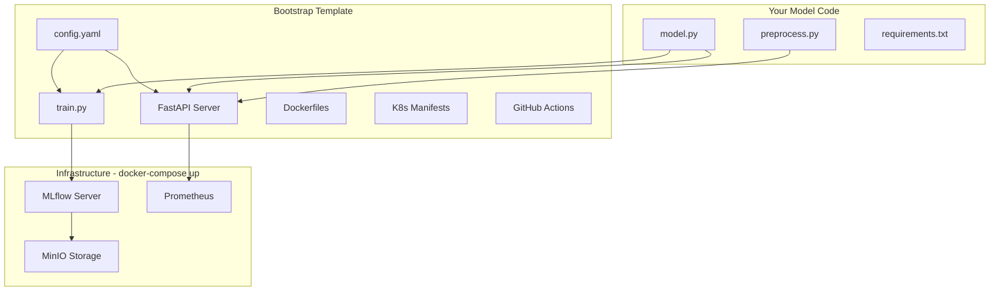
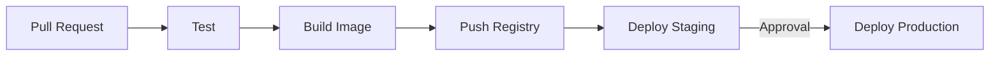

# ML Pipeline Bootstrap

A reusable MLOps template. Clone, plug in your model, deploy to production.

## Architecture



## Quick Start

```bash
# Clone and start infrastructure
git clone https://github.com/VineethKumar7/ml-pipeline.git
cd ml-pipeline
make up

# Run the example (Iris classifier)
make example-iris

# API is now running at http://localhost:8000
curl -X POST http://localhost:8000/predict \
  -H "Content-Type: application/json" \
  -d '{"features": [5.1, 3.5, 1.4, 0.2]}'
```

## Bring Your Own Model

### 1. Implement the Interface

Create `src/model.py`:

```python
class ModelWrapper:
    def __init__(self, config: dict):
        self.model = None
    
    def train(self, X, y, params: dict) -> dict:
        # Your training logic
        return {'accuracy': 0.95}
    
    def predict(self, features: list) -> dict:
        # Your inference logic
        return {'prediction': 1, 'probability': 0.92}
    
    def save(self, path: str):
        # Save model artifacts
        pass
    
    def load(self, path: str):
        # Load model artifacts
        pass
```

### 2. Update Configuration

Edit `config.yaml`:

```yaml
project:
  name: "my-project"

model:
  name: "my-model"
  module: "src.model"
  class: "ModelWrapper"

training:
  experiment: "my-experiment"
  params:
    epochs: 100
    learning_rate: 0.01
```

### 3. Train and Deploy

```bash
make train     # Train and register model
make serve     # Run API locally
make deploy    # Deploy to Kubernetes
```

## Project Structure

```
ml-pipeline/
├── config.yaml              # Main configuration
├── docker-compose.yml       # MLflow + MinIO + Postgres
├── Makefile                 # Commands
│
├── src/
│   ├── model.py            # YOUR MODEL HERE
│   ├── training/train.py   # Generic trainer
│   └── serving/main.py     # FastAPI server
│
├── examples/iris/          # Working example
├── docker/                 # Dockerfiles
├── k8s/                    # Kubernetes manifests
└── .github/workflows/      # CI/CD pipelines
```

## Commands

| Command | Description |
|---------|-------------|
| `make up` | Start infrastructure (MLflow, MinIO, Postgres) |
| `make down` | Stop infrastructure |
| `make train` | Train model using config.yaml |
| `make serve` | Run API locally |
| `make test` | Run tests |
| `make build` | Build Docker image |
| `make deploy-staging` | Deploy to staging |
| `make deploy-prod` | Deploy to production |

## CI/CD Pipeline



- **Pull Request** → Runs tests automatically
- **Git Tag** (`v*`) → Builds container, deploys to staging
- **Manual Approval** → Promotes to production

## API Endpoints

| Endpoint | Method | Description |
|----------|--------|-------------|
| `/predict` | POST | Model inference |
| `/health` | GET | Health check |
| `/model/info` | GET | Model version info |
| `/metrics` | GET | Prometheus metrics |

## Tech Stack

- **MLflow** — Experiment tracking & model registry
- **MinIO** — S3-compatible artifact storage
- **FastAPI** — Model serving API
- **Docker** — Containerization
- **Kubernetes (k3s)** — Orchestration
- **GitHub Actions** — CI/CD

## License

MIT
