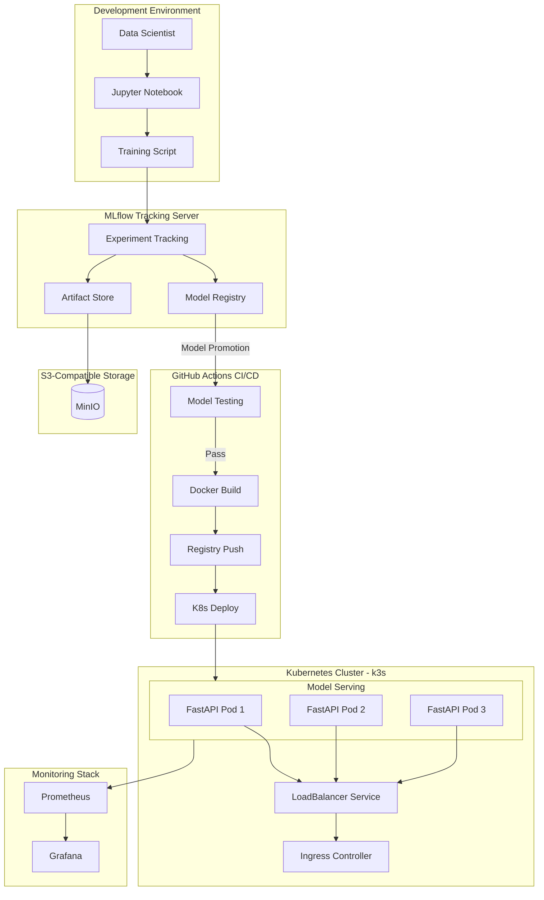
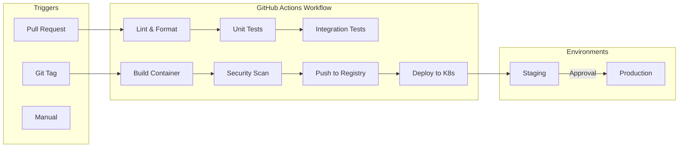
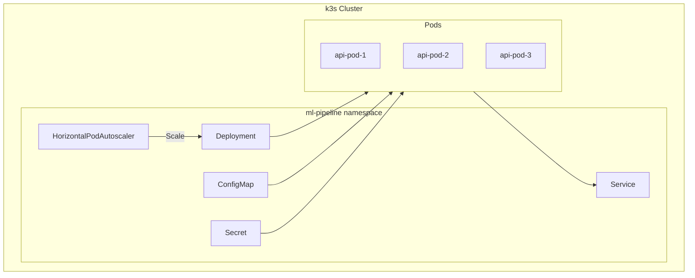

# ML Model Deployment Pipeline

End-to-end MLOps pipeline for deploying ML models to production using containerized microservices. Built with MLflow for experiment tracking, FastAPI for model serving, and Kubernetes for orchestration.

## Architecture



## Features

- **Experiment Tracking** — Log parameters, metrics, and artifacts with MLflow
- **Model Registry** — Version control for models with staging/production stages
- **S3-Compatible Storage** — MinIO for scalable artifact storage
- **Model Serving** — FastAPI with automatic OpenAPI docs and async support
- **Auto-Scaling** — Kubernetes HPA scales pods based on CPU/memory
- **CI/CD Pipeline** — Automated testing, building, and deployment via GitHub Actions
- **Observability** — Prometheus metrics and Grafana dashboards

## Tech Stack

| Component | Technology | Purpose |
|-----------|------------|---------|
| ML Tracking | MLflow | Experiment tracking, model registry |
| Object Storage | MinIO | S3-compatible artifact storage |
| API Framework | FastAPI | Model serving REST API |
| Containerization | Docker | Package application |
| Orchestration | Kubernetes (k3s) | Container orchestration |
| CI/CD | GitHub Actions | Automated pipeline |
| Monitoring | Prometheus + Grafana | Metrics & dashboards |

## Quick Start

### Prerequisites

- Docker & Docker Compose
- Python 3.10+
- kubectl (for Kubernetes deployment)

### 1. Start the Infrastructure

```bash
# Clone the repository
git clone https://github.com/VineethKumar7/ml-pipeline.git
cd ml-pipeline

# Start MLflow + MinIO + PostgreSQL
docker-compose up -d

# Verify services are running
docker-compose ps
```

### 2. Train and Register a Model

```bash
# Install dependencies
pip install -r requirements.txt

# Train a model (logs to MLflow automatically)
python src/training/train.py

# View experiments at http://localhost:5000
```

### 3. Run the Serving API

```bash
# Start the FastAPI server
uvicorn src.serving.main:app --reload --port 8000

# API docs available at http://localhost:8000/docs
```

### 4. Make Predictions

```bash
curl -X POST http://localhost:8000/predict \
  -H "Content-Type: application/json" \
  -d '{"features": [5.1, 3.5, 1.4, 0.2]}'
```

## Integrating Your Own Model

### Step 1: Prepare Your Training Script

Wrap your training code with MLflow tracking:

```python
import mlflow
import mlflow.sklearn  # or mlflow.pytorch, mlflow.tensorflow

mlflow.set_tracking_uri("http://localhost:5000")
mlflow.set_experiment("my-experiment")

with mlflow.start_run():
    # Log parameters
    mlflow.log_param("learning_rate", 0.01)
    mlflow.log_param("epochs", 100)
    
    # Train your model
    model = train_model(X_train, y_train)
    
    # Log metrics
    mlflow.log_metric("accuracy", accuracy)
    mlflow.log_metric("f1_score", f1)
    
    # Log the model
    mlflow.sklearn.log_model(
        model, 
        "model",
        registered_model_name="my-model"
    )
```

### Step 2: Promote Model to Production

```python
from mlflow.tracking import MlflowClient

client = MlflowClient()

# Transition model to Production stage
client.transition_model_version_stage(
    name="my-model",
    version=1,
    stage="Production"
)
```

Or via MLflow UI: Navigate to Models → Select Version → Stage → Transition to Production

### Step 3: Update the Serving Configuration

```bash
# Set environment variables
export MODEL_NAME=my-model
export MODEL_STAGE=Production

# Restart the serving API
docker-compose restart api
```

### Step 4: Custom Preprocessing (Optional)

If your model needs custom preprocessing, extend the `ModelWrapper` class:

```python
# src/serving/model.py

class ModelWrapper:
    def __init__(self):
        self.model = self._load_model()
        self.preprocessor = self._load_preprocessor()
    
    def predict(self, features: list) -> dict:
        # Apply your preprocessing
        processed = self.preprocessor.transform([features])
        
        # Get prediction
        prediction = self.model.predict(processed)
        probability = self.model.predict_proba(processed).max()
        
        return {
            "prediction": int(prediction[0]),
            "probability": float(probability)
        }
```

## CI/CD Pipeline



### Pipeline Stages

| Stage | Trigger | Actions |
|-------|---------|---------|
| **CI** | Pull Request | Lint, unit tests, integration tests |
| **Build** | Git Tag (`v*`) | Build Docker image, security scan |
| **Deploy Staging** | Build Success | Deploy to staging cluster |
| **Deploy Production** | Manual Approval | Rolling update to production |

## API Reference

### Endpoints

| Endpoint | Method | Description |
|----------|--------|-------------|
| `/health` | GET | Liveness/readiness probe |
| `/predict` | POST | Model inference |
| `/model/info` | GET | Current model version & metadata |
| `/metrics` | GET | Prometheus metrics |

### Prediction Request

```json
POST /predict
Content-Type: application/json

{
  "features": [5.1, 3.5, 1.4, 0.2],
  "model_version": "latest"  // optional
}
```

### Prediction Response

```json
{
  "prediction": 0,
  "probability": 0.97,
  "model_version": "v1.2.0",
  "latency_ms": 8.3
}
```

## Kubernetes Deployment



### Deploy to Kubernetes

```bash
# Create namespace
kubectl create namespace ml-pipeline

# Apply configurations
kubectl apply -k k8s/overlays/production

# Check deployment status
kubectl get pods -n ml-pipeline

# Get service endpoint
kubectl get svc -n ml-pipeline
```

### Scaling Configuration

The HorizontalPodAutoscaler automatically scales based on CPU utilization:

```yaml
# k8s/base/hpa.yaml
spec:
  minReplicas: 2
  maxReplicas: 10
  metrics:
    - type: Resource
      resource:
        name: cpu
        targetAverageUtilization: 70
```

## Environment Variables

| Variable | Description | Default |
|----------|-------------|---------|
| `MLFLOW_TRACKING_URI` | MLflow server URL | `http://mlflow:5000` |
| `MODEL_NAME` | Registered model name | `iris-classifier` |
| `MODEL_STAGE` | Model stage to load | `Production` |
| `S3_ENDPOINT_URL` | MinIO endpoint | `http://minio:9000` |
| `AWS_ACCESS_KEY_ID` | MinIO access key | - |
| `AWS_SECRET_ACCESS_KEY` | MinIO secret key | - |
| `LOG_LEVEL` | Logging level | `INFO` |

## Project Structure

```
ml-pipeline/
├── src/
│   ├── training/          # Model training scripts
│   │   ├── train.py
│   │   └── evaluate.py
│   └── serving/           # FastAPI application
│       ├── main.py
│       ├── model.py
│       └── schemas.py
├── tests/                 # Unit and integration tests
├── docker/                # Dockerfiles
├── k8s/                   # Kubernetes manifests
├── .github/workflows/     # CI/CD pipelines
└── docker-compose.yml     # Local development stack
```

## Monitoring

Access the monitoring dashboards:

- **MLflow UI**: http://localhost:5000
- **Grafana**: http://localhost:3000 (admin/admin)
- **Prometheus**: http://localhost:9090

### Key Metrics

| Metric | Description |
|--------|-------------|
| `prediction_latency_seconds` | Inference time histogram |
| `prediction_requests_total` | Total prediction requests |
| `model_load_time_seconds` | Time to load model from registry |
| `active_model_version` | Currently loaded model version |

## Contributing

1. Fork the repository
2. Create a feature branch (`git checkout -b feature/amazing-feature`)
3. Run tests (`pytest tests/`)
4. Commit changes (`git commit -m 'Add amazing feature'`)
5. Push to branch (`git push origin feature/amazing-feature`)
6. Open a Pull Request

## License

MIT License - see [LICENSE](LICENSE) for details.
