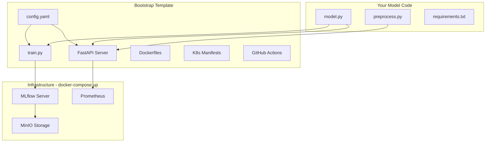
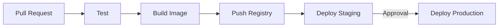

# ML Pipeline Bootstrap

A reusable MLOps template. Clone, run setup, plug in your model, deploy to production.

## Architecture



## Installation

```bash
# Clone the repository
git clone https://github.com/VineethKumar7/ml-pipeline.git my-project
cd my-project

# Run interactive setup
python setup.py
```

### Setup Wizard

The setup wizard configures your project. Press **Enter** to accept defaults or type your values:

```
🚀 ML Pipeline Setup Wizard
━━━━━━━━━━━━━━━━━━━━━━━━━━━

Project Configuration
─────────────────────
Project name [ml-pipeline]: sentiment-api
Version [1.0.0]: 
Description [ML model deployment pipeline]: Sentiment analysis service

Model Configuration
───────────────────
Model name [my-model]: sentiment-classifier
ML framework (sklearn/pytorch/tensorflow) [sklearn]: pytorch
Model module path [src.model]: 
Model class name [ModelWrapper]: 

Training Configuration
──────────────────────
Experiment name [default]: sentiment-exp
Track with MLflow? (y/n) [y]: 

Serving Configuration
─────────────────────
API port [8000]: 
Number of workers [4]: 

Infrastructure
──────────────
Start MLflow server? (y/n) [y]: 
Start MinIO storage? (y/n) [y]: 

Kubernetes (optional)
─────────────────────
Configure Kubernetes? (y/n) [n]: y
Namespace [ml-pipeline]: 
Min replicas [2]: 
Max replicas [10]: 

━━━━━━━━━━━━━━━━━━━━━━━━━━━

✅ Configuration saved to config.yaml
✅ Project structure created

Next steps:
  1. Implement your model in src/model.py
  2. Run 'make up' to start infrastructure
  3. Run 'make train' to train your model
  4. Run 'make serve' to start the API
```

### Default Configuration

| Setting | Default | Description |
|---------|---------|-------------|
| Project name | `ml-pipeline` | Project identifier |
| Model name | `my-model` | MLflow model registry name |
| Framework | `sklearn` | sklearn, pytorch, tensorflow |
| API port | `8000` | FastAPI server port |
| Workers | `4` | Uvicorn workers |
| MLflow port | `5000` | Tracking server |
| MinIO port | `9000` | S3-compatible storage |
| K8s replicas | `2-10` | Auto-scaling range |

## Quick Start

```bash
# After setup, start infrastructure
make up

# Run the included example (Iris classifier)
make example-iris

# Test the API
curl -X POST http://localhost:8000/predict \
  -H "Content-Type: application/json" \
  -d '{"features": [5.1, 3.5, 1.4, 0.2]}'
```

## Integrate Your Model

### 1. Implement the Interface

Edit `src/model.py`:

```python
class ModelWrapper:
    def __init__(self, config: dict):
        self.model = None
    
    def train(self, X, y, params: dict) -> dict:
        # Your training logic
        return {'accuracy': 0.95}
    
    def predict(self, features: list) -> dict:
        # Your inference logic
        return {'prediction': 1, 'probability': 0.92}
    
    def save(self, path: str):
        # Save model artifacts
        pass
    
    def load(self, path: str):
        # Load model artifacts
        pass
```

### 2. Train and Deploy

```bash
make train     # Train and register model
make serve     # Run API locally
make deploy    # Deploy to Kubernetes
```

## Project Structure

```
my-project/
├── setup.py                 # Interactive setup wizard
├── config.yaml              # Generated configuration
├── docker-compose.yml       # MLflow + MinIO + Postgres
├── Makefile
│
├── src/
│   ├── model.py            # YOUR MODEL
│   ├── training/train.py   # Generic trainer
│   └── serving/main.py     # FastAPI server
│
├── examples/iris/          # Working example
├── docker/                 # Dockerfiles
├── k8s/                    # Kubernetes manifests
└── .github/workflows/      # CI/CD
```

## Commands

| Command | Description |
|---------|-------------|
| `python setup.py` | Run interactive setup |
| `make up` | Start infrastructure |
| `make down` | Stop infrastructure |
| `make train` | Train model |
| `make serve` | Run API locally |
| `make test` | Run tests |
| `make build` | Build Docker image |
| `make deploy-staging` | Deploy to staging |
| `make deploy-prod` | Deploy to production |

## CI/CD Pipeline



## API Endpoints

| Endpoint | Method | Description |
|----------|--------|-------------|
| `/predict` | POST | Model inference |
| `/health` | GET | Health check |
| `/model/info` | GET | Model version |
| `/metrics` | GET | Prometheus metrics |

## License

MIT
